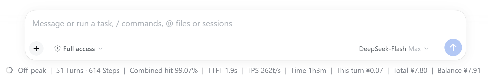
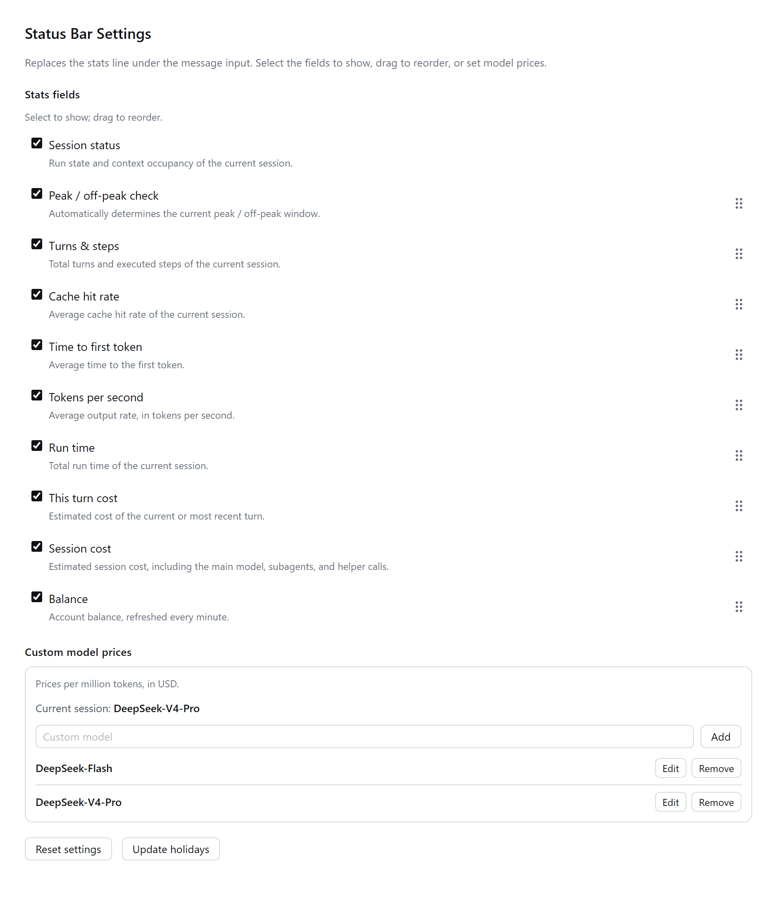
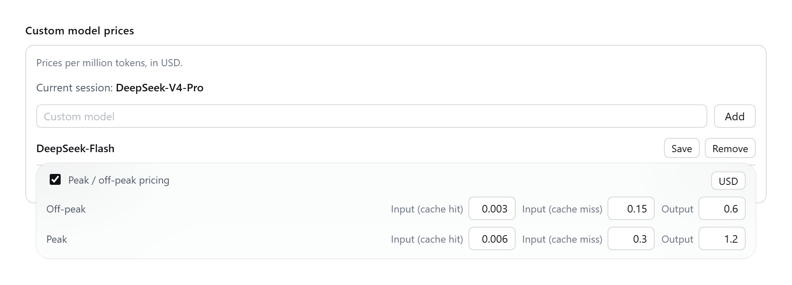

<h1 align="center">dsh-desktop-statusbar</h1>

<p align="center">
  <a href="https://github.com/raphael-y7/dsh-desktop-statusbar/stargazers"></a>
  <a href="https://www.npmjs.com/package/dsh-desktop-statusbar"></a>
  <a href="LICENSE"></a>
  <a href="https://github.com/deepseek-ai/deepseek-harness"></a>
  <a href="https://nodejs.org/"></a>
  
  <a href="https://dshfind.com/zh/plugins/raphael-y7/dsh-desktop-statusbar"></a>
  <a href="https://deepseek1024.com/plugins/Rapheal-Y7/dsh-desktop-statusbar"></a>
</p>

<p align="center"><a href="README.md">中文</a> | English</p>

Replaces the stats line under the message input in the DSH desktop app with a configurable status bar: pick your fields, arrange their order, enter your own prices, choose the currency, and get live cost estimates using DeepSeek's official peak/off-peak rates.

> Noncommercial licence: free for personal, study, teaching and nonprofit use, with modification allowed; **commercial use is not permitted** ([PolyForm Noncommercial 1.0.0](LICENSE)).



## Features

- **10 optional fields**: session status, peak / off-peak check, turns and steps, combined hit, TTFT, TPS, run time, this turn cost, session cost, balance
- **Click a field for details**:

  | Field | Content |
  | --- | --- |
  | Session status | Context occupancy: system prompt / tool definitions / messages |
  | Combined hit | Highest / lowest cache hit rate |
  | TTFT | Fastest / slowest first-token delay |
  | TPS | Fastest / slowest output speed |
  | Run time | Model time / tool calls |
  | This turn cost | Token breakdown for this turn |
  | Session cost | Cumulative token breakdown for the whole session |
  | Balance | Top-up balance / granted balance |

- **Cost estimation**: official peak/off-peak rules, each call priced at the moment it happened and with the model it used
- **Price book**: your own prices, an optional peak/off-peak split, a CNY / USD currency switch
- **Also**: one-click holiday calendar update, balance refreshed every minute, bilingual UI

## Install

In the DSH desktop app open **Plugins → Add plugin** and enter the package name:

```
dsh-desktop-statusbar
```

Then press Install. On a slow connection to the npm registry, switch the install source to the China mainland mirror in the same dialog. A GitHub URL works too:

```
https://github.com/raphael-y7/dsh-desktop-statusbar
```

The command-line equivalent:

```powershell
dsh plugin --profile desktop add dsh-desktop-statusbar
```

Published on npm and listed on [dshfind](https://dshfind.com/zh/plugins/raphael-y7/dsh-desktop-statusbar) and [1024Store](https://deepseek1024.com/plugins/Rapheal-Y7/dsh-desktop-statusbar).

## Usage

Open **Settings → Status bar**:



- **Session status**: the ring at the front of the bar — progress shows context occupancy, colour shows the run state (grey idle / green running / red error / amber pending approval). Click it to see how much the system prompt, tool definitions and messages each take up
- **Stats fields**: tick what you want to show; unticking only hides a field without moving it. Drag the six-dot handle on the right to reorder, or use "Reset settings" to restore the factory order
- **Custom model prices**: type a model name and click "Add" to create an entry; "Edit" opens the editor and only "Save" writes it. Tick "peak / off-peak pricing" when you need the time-of-day split — otherwise a flat all-day price is used
- **Currency**: the CNY / USD switch in the top-right corner of the editor. Switching swaps the two built-in models to that currency's official reference prices (entries you edited are kept) and changes the symbol in the cost fields; the balance always follows the currency the API reports
- **Holidays**: "Update holidays" fetches and writes the next year's public-holiday calendar
- **Balance**: refreshed automatically once a minute

### Billing rules

Peak hours are **09:00–12:00 and 14:00–18:00 Beijing time, Monday to Friday**, and off-peak rates are half the peak rates; Chinese public holidays and weekends are billed off-peak all day (matching the [official docs](https://api-docs.deepseek.com/quick_start/pricing), checked 2026-09).



## Known limitations

- Fastest / slowest TTFT and speed come from a new host-side projection: **you must fully quit and restart DSH** before it starts collecting
- A model without a price is skipped rather than mis-priced; adding the price back-fills its earlier calls

## Development

```powershell
node tools/test.cjs
```

## Licence

[PolyForm Noncommercial 1.0.0](LICENSE): permitted for personal, research, study, teaching and nonprofit use, and for modification and redistribution (keep attribution); **commercial use is not permitted**.
