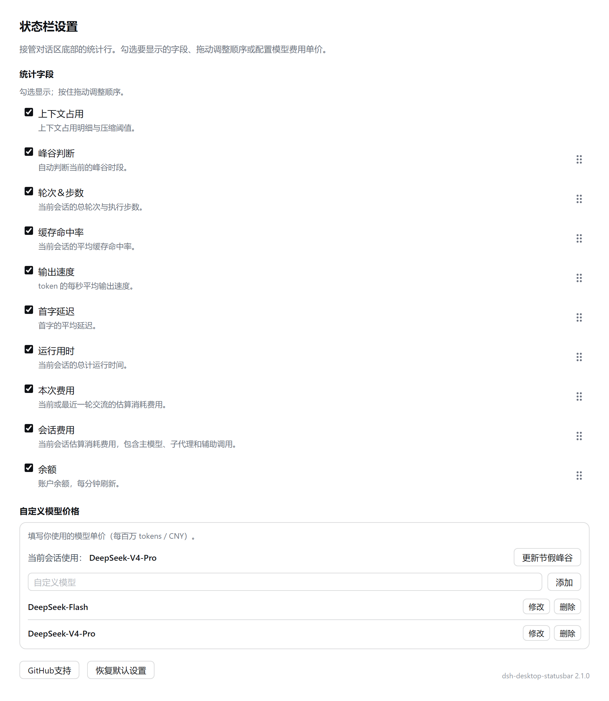
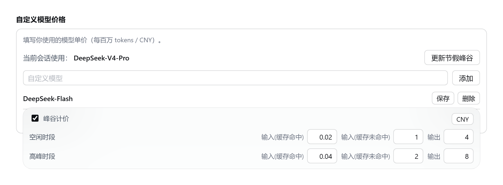

<h1 align="center">dsh-desktop-statusbar</h1>

<p align="center">
  <a href="https://github.com/raphael-y7/dsh-desktop-statusbar/stargazers"></a>
  <a href="https://github.com/deepseek-ai/deepseek-harness"></a>
  <a href="https://dshfind.com/zh/plugins/raphael-y7/dsh-desktop-statusbar"></a>
  <a href="https://deepseek1024.com/plugins/Rapheal-Y7/dsh-desktop-statusbar"></a>
  <a href="https://www.npmjs.com/package/dsh-desktop-statusbar"></a>
  <a href="https://nodejs.org/"></a>
  
  <a href="LICENSE"></a>
</p>

<p align="center">中文 | <a href="README.en.md">English</a></p>

以一条可配置的状态栏替换 DSH 桌面端对话区底部的统计行：字段、顺序、模型单价与计价单位均可配置，费用按官方峰谷口径实时估算。


## 功能

- **10 个可选字段**：上下文占用（栏首圆环）、峰谷判断、轮次与步数、综合命中、综合速度、首字平均、运行用时、本轮费用、总计费用、余额
- **点击字段可查看详情**：

  | 字段 | 内容 |
  | --- | --- |
  | 上下文占用（栏首圆环） | 系统提示词 / 工具定义 / 对话消息 |
  | 峰谷判断 | 日 / 周 / 月 / 年数据统计热力图 |
  | 轮次与步数 | 上下文压缩 / 技能注入 / 工具调用 |
  | 综合命中 | 本轮 / 最高 / 最低缓存命中率 |
  | 综合速度 | 本轮 / 最快 / 最慢速度 |
  | 首字平均 | 本轮 / 最快 / 最慢首字延迟 |
  | 运行用时 | 等待用时 / 模型用时 / 工具调用 |
  | 本轮费用 | 本轮会话的 token 明细 |
  | 总计费用 | 整个会话累计的 token 明细 |
  | 余额 | 充值余额 / 赠金余额 / 剩余配额 |

- **点开「轮次与步数」可下钻**：三行——上下文压缩（逐次列出压缩发生在第几轮第几步）、技能注入（含注入进会话的全局提示词 `AGENTS.md`，排在最前）、工具调用（按次数列出用过的每个工具）；再点某一行继续展开明细，点标题回到上一层
- **版本自检与一键更新**：启动时比对 npm 上的最新版本，有新版就在「状态栏」导航项旁挂一个提示胶囊，设置页里出现「更新」按钮，点一下直接装
- **活跃总览**：鼠标移到「峰谷判断」上看当天用量，点开是整月热力图，可切到周与全年。数据来自本地用量账本，**会话记录被删也不会丢**
- **费用估算**：按官方峰谷口径计价，每条调用按其发生时刻与所用模型分别计算
- **价格库**：自定义单价、峰谷分档、CNY / USD 计价单位
- **其他**：节假日日历一键更新、账户余额每分钟刷新、中英双语

## 安装

在 DSH 桌面端打开 **插件 → 添加插件**，输入包名后安装：

```
dsh-desktop-statusbar
```

网络受限时，可在同一对话框内将安装源切换为「中国大陆镜像源」。亦支持 GitHub 仓库地址：

```
https://github.com/raphael-y7/dsh-desktop-statusbar
```

命令行方式：

```powershell
dsh plugin --profile desktop add dsh-desktop-statusbar
```

### 从 npm 安装

插件面板与命令行两种方式，安装源默认都是 npm registry，包名为 `dsh-desktop-statusbar`。想确认 npm 上的当前版本：

```powershell
npm view dsh-desktop-statusbar version
```

本插件亦收录于 [dshfind](https://dshfind.com/zh/plugins/raphael-y7/dsh-desktop-statusbar) 与 [1024Store](https://deepseek1024.com/plugins/Rapheal-Y7/dsh-desktop-statusbar)。

## 使用

打开 **设置 → 状态栏**：



- **会话状态**：栏首圆环，进度表示上下文占用，颜色表示运行状态（空闲灰 / 运行绿 / 报错红 / 待审批黄），点击查看各部分的 token 构成
- **统计字段**：勾选控制显示，取消勾选仅隐藏、不改变位置；拖动右侧把手调整顺序；「恢复默认设置」恢复出厂顺序并全选
- **自定义模型价格**：输入模型名并「添加」以新增条目；「修改」展开编辑区，保存后写入；需区分峰谷时段时勾选「峰谷计价」，否则按全天同价计算
- **计价单位**：价格编辑区右上角可选 CNY 或 USD。切换时内置的两款模型改用对应币种的官方参考价（已修改的条目保留），费用段的符号随之变化；余额按接口返回的币种显示
- **节假日**：点「更新节假峰谷」获取并写入下一年的放假安排
- **余额**：每分钟自动刷新

### 计费口径

高峰时段为**北京时间周一至周五 9:00-12:00、14:00-18:00**，空闲价为高峰价的一半；法定节假日与周末全天按空闲价计费（与[官方文档](https://api-docs.deepseek.com/zh-cn/quick_start/pricing)一致，2026-09 核对）。



## 已知限制

- 最快 / 最慢首字与速度来自 host 新增的投影，**升级后需完全退出并重启 DSH** 才开始统计
- 价格库中缺少单价的模型不计费，补充单价后自动补算

## 开发

```powershell
node tools/test.cjs
```

## 许可

[MIT](LICENSE)：可自由使用、修改与再分发，包括商业用途；保留版权与许可声明即可。
